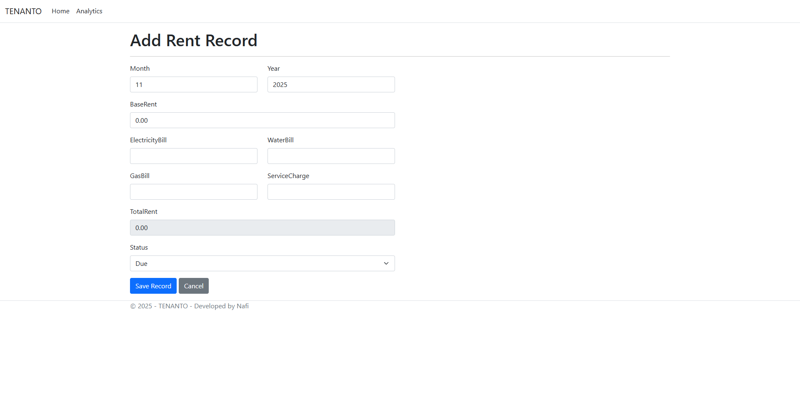

# Tenanto — Tenant & Rent Tracker

Tenanto is a lightweight, single-user Tenant and Rent Tracker web application built with ASP.NET Core MVC 8 and C#. It’s designed for individual landlords who want to track tenants and monthly rent records without needing authentication or multi-user support.

---

## Screenshots

- **Dashboard** – View and manage tenants  
  <p align="center">
  
</p>

- **Tenant Rent Log** – Month-by-month rent history  
  <p align="center">
  
</p>

- **Add Rent Form** – Add new rent records easily  
  <p align="center">
  
</p>

---

## Features

- **Single landlord mode** — No login or registration required  
- **Tenant management** — View all tenants in one dashboard  
- **Rent records tracking** — Month-by-month rent details per tenant  
- **Automatic total rent calculation** — Done via small vanilla JS snippet  
- **Bangladeshi Taka (BDT)** currency formatting throughout  
- **Built with Bootstrap** for a clean, responsive UI  
- **Entity Framework Core (EF Core)** for database interaction  
- **SQL Server** backend for structured, reliable data storage  

---

## Tech Stack

| Layer | Technology |
|-------|-------------|
| **Frontend** | HTML, CSS, Bootstrap, JavaScript |
| **Backend** | ASP.NET Core MVC 8 (C#) |
| **Database** | Microsoft SQL Server |
| **ORM** | Entity Framework Core |

---

## Project Structure


Tenanto/
├── Controllers/
│   └── HomeController.cs
├── Models/
│   ├── Tenant.cs
│   └── RentRecord.cs
├── Views/
│   ├── Home/
│   │   ├── Index.cshtml        ← Dashboard
│   │   ├── RentLog.cshtml      ← Tenant rent history
│   │   └── AddRent.cshtml      ← Add rent record form
├── appsettings.json            ← Connection string configuration
├── Program.cs
├── Startup.cs
└── Tenanto.sln

## Setup Instructions

### 1. Prerequisites
Make sure you have:
- [Visual Studio 2022](https://visualstudio.microsoft.com/vs/) (with ASP.NET & web development workload)
- [Microsoft SQL Server](https://www.microsoft.com/en-us/sql-server/sql-server-downloads)
- [.NET 8 SDK](https://dotnet.microsoft.com/download/dotnet/8.0)


### 2. Database Setup
1. Open SQL Server Management Studio (SSMS).  
2. Run SQL script to create the database and tables:


### 3. Configure Connection String
In `appsettings.json`, update the connection string to match your local SQL Server instance:
```json
"ConnectionStrings": {
  "DefaultConnection": "Server=YOUR_SERVER_NAME;Database=TenantoDB;Trusted_Connection=True;TrustServerCertificate=True;"
}
```

### 4. Run the Application

1. Open the `Tenanto.sln` file in Visual Studio.
2. Press **F5** or click **Start Debugging**.
3. The Kestrel server will launch and open the app in your default browser.


## How It Works

* **Dashboard:** Lists all tenants stored in the SQL database.
* **Rent Log:** Shows detailed rent history per tenant (base rent, bills, total rent, payment status).
* **Add Rent Form:** Lets you add new monthly rent entries, with client-side validation and total rent auto-calculation.


## Example Data Flow

1. Landlord opens dashboard → clicks **"View Rent Log"** on a tenant.
2. Views all previous rent records for that tenant.
3. Clicks **"Add New Rent Record"** → fills in rent details → saves.
4. Data gets stored in the `RentRecords` table via EF Core.


## Author

**Developed by:** Nafi
